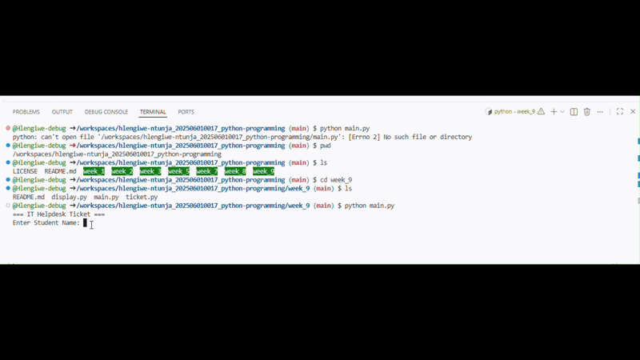

# IT Helpdesk Ticket Registration System

## 1. Purpose of the application
This simple Python application is designed for the IT Support team of City University Malaysia. It allows students to register technical issues (such as login problems, WiFi issues, or printer malfunctions) by creating a digital helpdesk ticket. 

## 2. Tech Stack
* **Language:** Python 3
* **Methodology:** Modular Programming (divided into `main.py`, `ticket.py`, and `display.py`)

## 3. How to use
1. Open your terminal or command prompt.
2. Navigate to the `week_9` directory where the files are saved.
3. Run the application using the command:
   ```bash
   python main.py

Summarize the entire application

4.1. Purpose of the application

This application streamlines the process for students to report IT issues. Before technicians can investigate, a helpdesk ticket must be created. This system collects the student's details, the nature of the issue, and the priority level to ensure the right technician is assigned.

4.2. Tech Stack

The application is built using Python 3 and follows a Modular Programming approach to keep the code clean, organized, and easy to maintain. It is divided into three specific files:

· main.py: The driver script that coordinates the flow of the program.
· ticket.py: Handles the input logic and assigns the technician based on priority rules.
· display.py: Handles the formatting and printing of the final ticket output.

4.3. How to use

1. Open your terminal or command prompt.
2. Navigate to the week_9 directory.
3. Run the application using the command: python main.py.
4. Follow the text prompts to enter your Student Name, Student ID, Issue details, Location, and Priority (High, Medium, or Low).
5. The system will automatically assign a technician based on your priority input (High = Ahmad, Medium = Siti, Low = Ali) and display the complete ticket information.

4.4. Demonstrate the application using screen recording (Video/GIF)




```
```